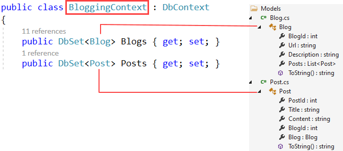
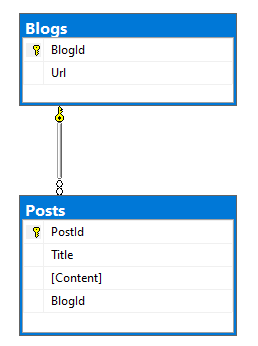
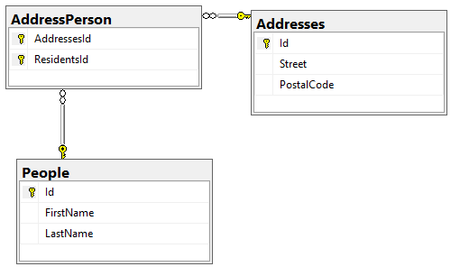
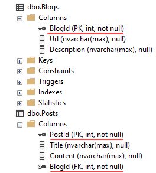
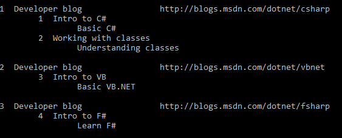

## What is Entity Framework Core?

*From Microsoft*

Entity Framework (EF) Core is a lightweight, extensible, open source and cross-platform version of the popular Entity Framework data access technology.

EF Core can serve as an object-relational mapper (O/RM), which:

- Enables .NET developers to work with a database using .NET objects.
- Eliminates the need for most of the data-access code that typically needs to be written.

:purple_circle: Recommend reading the rest of the documentation [here](https://docs.microsoft.com/en-us/ef/core/).


# Requirements

- Basic understanding of
  - C# langugage
  - Classes
  - Working with SQL
  - object-oriented programming (OOP) 
- Microsoft Visual Studio 2019 or higher
  - Alternate, Visual Studio Code but all examples are written in Visual Studio
- Microsoft .NET Core 5 Framework or higher
- Microsoft SQL-Server Management Studio (SSMS)

# Code style

- Variables, classes, properties and methods are standard styling
- No one character variable names
- Uses lambda rather than LINQ, either will work.
- Basic exception handling using Tuples and Deconstruct, see [the following](https://docs.microsoft.com/en-us/dotnet/csharp/fundamentals/functional/deconstruct) for more details


# Unused code

There will be code that in the beginning will not be used but will as lessons progress, for instance code for logging and or viewing queries EF Core generates.

# Connection strings

At the base level connection strings will be in a class and later will be broken out to a json file then a bit more complexity for adapting to environments (development, staging/testing and production).

Developers tend to take the easy path which is to place a connection string to a database in code. 

This can work for hobbyist building personal applications while someone building applications for profit or for a job really should have three environments which for desktop applications. 

Typically are in a single json file for desktop applications while for web development there are several paths, using a json file in tangent with an environment variable which means the web application can move from server environment to another and know which database to use per the environment.

Basic connection string in a file named appsettings.json

```json
{
  "ConnectionStrings": {
    "DatabaseConnection": "Data Source=.\\SQLEXPRESS;Initial Catalog=NorthWind2020;Integrated Security=True"
  }
}
```

An example for multiple envonments for desktop

```json
{
  "ConnectionsConfiguration": {
    "ActiveEnvironment": "Production",
    "Development": "Dev connection string goes here",
    "Stage": "Stage connection string goes here",
    "Production": "Prod connection string goes here"
  }
}
```

For web applications there can be multiple json files e.g. `appsettings.development.json`, `appsettings.staging.json` and `appsettings.production.json`.

In this reposiory there is the `Saving` project which was taken from the Microsoft repository, slightly modified in regards to properties in the blog class and code samples have been modified also.

Let's dig in to the code in `savings` project.


# Level 1 The basics

EF supports the following model development approaches:

- Generate a model from an existing database.
- Hand code a model to match the database.
    - Once a model is created, use EF Migrations to create a database from the model. Migrations allow evolving the database as the model changes.


The development model we will use throughout the series is `generate a model from an existing database`.

But before we get to this model let’s look at the reasoning. 

There are several reasons.

The first, many shops have analyst work with business requirements from clients which once approved a database administrator create the database followed by developers using the database.

Second main reason is that developers just starting out working with EF Core do not know how to write code properly for generating databases and tables properly.

Once a developer is comfortable with configuring EF Core databases and is not restricted by company policies they can use hand code a model to match a database.

## Microsoft code samples

The following Microsoft GitHub [repository folder](https://github.com/dotnet/EntityFramework.Docs/tree/main/samples/core) has several code samples but are difficult for some developers to get and understand from the main repository.

These examples are based off a `Blog` and `Post` table where a blog can have zero or more post entries.

We start off in a [DbContext](https://docs.microsoft.com/en-us/dotnet/api/system.data.entity.dbcontext?view=entity-framework-6.2.0)

*A DbContext instance represents a combination of the Unit Of Work and Repository patterns such that it can be used to query from a database and group together changes that will then be written back to the store as a unit.*

Okay, what does that mean in plain speak? A DbContext handles configuring tables, their properties indices and so far along with defining relations for your database.

A typical DbContext and remember that connection strings should only be stored for personal applications while anything else should be in a appsettings.json file.

```csharp
namespace Saving.Data
{
    public class BloggingContext : DbContext
    {
        public DbSet<Blog> Blogs { get; set; }
        public DbSet<Post> Posts { get; set; }

        private static string _connectionString = "Server=(localdb)\\mssqllocaldb;Database=EFSaving.RelatedData;Trusted_Connection=True";
        protected override void OnConfiguring(DbContextOptionsBuilder optionsBuilder)
        {
            optionsBuilder.UseSqlServer(_connectionString);
        }
    }
}
```

Next level up for a DbContext is to have methods to log information which can be very useful when there are issues or performance problems.

Below `NoLogging` is used when not hunting down issues while `StandardLogging` is used for debugging which sends output to Visual Studio's output window.

```
using System.Diagnostics;
using Microsoft.EntityFrameworkCore;
using Microsoft.EntityFrameworkCore.Diagnostics;
using Microsoft.Extensions.Logging;
using Saving.Helpers;
using Saving.Models;

namespace Saving.Data
{
    public class BloggingContext : DbContext
    {
        public DbSet<Blog> Blogs { get; set; }
        public DbSet<Post> Posts { get; set; }

        private static string _connectionString = 
            "Server=(localdb)\\mssqllocaldb;Database=EFSaving.RelatedData;Trusted_Connection=True";
        protected override void OnConfiguring(DbContextOptionsBuilder optionsBuilder)
        {
            NoLogging(optionsBuilder);
        }

        /// <summary>
        /// Simple configuration for setting the connection string
        /// </summary>
        /// <param name="optionsBuilder"></param>
        private static void NoLogging(DbContextOptionsBuilder optionsBuilder)
        {
            optionsBuilder.UseSqlServer(_connectionString);
        }

        /// <summary>
        /// Default logging to output window
        /// </summary>
        /// <param name="optionsBuilder"></param>
        private static void StandardLogging(DbContextOptionsBuilder optionsBuilder)
        {
            optionsBuilder.UseSqlServer(_connectionString)
                .EnableSensitiveDataLogging()
                .LogTo(message => Debug.WriteLine(message));
        }

    }
}
```

Note the two [DbSet](https://docs.microsoft.com/en-us/dotnet/api/system.data.entity.dbset-1?view=entity-framework-6.2.0#:~:text=A%20DbSet%20represents%20the%20collection,a%20DbContext%20using%20the%20DbContext.)

A `DbSet` represents the collection of all entities in the context, or that can be queried from the database, of a given type. DbSet objects are created from a DbContext using the DbContext.Set method.

**See also** [ApplicationDbContext](https://docs.microsoft.com/en-us/ef/core/dbcontext-configuration/#dbcontext-in-dependency-injection-for-aspnet-core)

**In Solution Explorer**




**In SSMS**



## Super important

When looking at the code in `Data\BloggingContext.cs` there is no code to configure relations, EF Core picks up on the list of post in the blogs class which EF Core will configure that a blog can have zero to many post while in the post class there is a blog property which EF Core will configure that a post has a blog along with the blog id property.

In the case of Blog/Post EF Core configures relations perfectly. But that is not always going to be true.

Let's look at another example, a person class which has zero to many addresses.

**Person class/model**

```csharp
public class Person
{
    public int Id { get; set; }
    public string FirstName { get; set; }
    public string LastName { get; set; }
    public List<Address> Addresses { get; set; }
    public override string ToString() => $"{FirstName} {LastName}";
}
```
**Address class/model**

```csharp
public class Address
{
    public int Id { get; set; }
    public string Street { get; set; }
    public string PostalCode { get; set; }
    public List<Person> Residents { get; set; }
    public override string ToString() => Street;

}
```

Without a developer configuring anything in regards to relations EF Core generates.

- People table
- Address table
- AddressPerson table (junction table)

**In SSMS**



Yes we can query data with EF Core but if you were to look at the SQL, it's fairly complex.

```csharp
public class ReadOperations
{
    public static async Task ReadPeople()
    {

        Debug.WriteLine(new string('_', 50));
        Debug.WriteLine($"✔ {nameof(ReadPeople)}");
        Debug.WriteLine(new string('_', 50));

        await using var context = new PersonContext();

        List<Person> people = await context
            .People
            .Include(person => person.Addresses)
            .ToListAsync();

        foreach (var person in people)
        {
            Debug.WriteLine($"{person.Id} {person.FirstName} {person.LastName}");
            foreach (var address in person.Addresses)
            {
                Debug.WriteLine($"\t{address.Id} {address.Street} {address.PostalCode}");
            }
        }

        Debug.WriteLine("");
    }
```

SQL generated when EF Core configures things.

```sql
SELECT p.Id, 
       p.FirstName, 
       p.LastName, 
       t.AddressesId, 
       t.ResidentsId, 
       t.Id, 
       t.PostalCode, 
       t.Street, 
       t0.Id, 
       t0.DeviceTypeId, 
       t0.PersonId, 
       t0.[Value], 
       t0.Id0, 
       t0.Description
FROM People AS p
     LEFT JOIN
(
    SELECT a.AddressesId, 
           a.ResidentsId, 
           a0.Id, 
           a0.PostalCode, 
           a0.Street
    FROM AddressPerson AS a
         INNER JOIN Addresses AS a0 ON a.AddressesId = a0.Id
) AS t ON p.Id = t.ResidentsId
     LEFT JOIN
(
    SELECT c.Id, 
           c.DeviceTypeId, 
           c.PersonId, 
           c.[Value], 
           d.Id AS Id0, 
           d.Description
    FROM ContactDevice AS c
         INNER JOIN DeviceType AS d ON c.DeviceTypeId = d.Id
) AS t0 ON p.Id = t0.PersonId
ORDER BY p.Id, 
         t.AddressesId, 
         t.ResidentsId, 
         t.Id, 
         t0.Id, 
         t0.Id0;

```

How did we get the SQL above. In the DbContext class there is the following method which writes each query to Visual Studio's output window.

```
private static void StandardLogging(DbContextOptionsBuilder optionsBuilder)
{
    optionsBuilder.UseSqlServer(_connectionString)
        .EnableSensitiveDataLogging()
        .LogTo(message => Debug.WriteLine(message));
}
```

With that said, let's take a peek forward. When adding and modifying records, before commiting changes to the backend database we can peek at the changes and even abort changes.

This is done with [DebugView.LongView](https://docs.microsoft.com/en-us/dotnet/api/microsoft.entityframeworkcore.infrastructure.debugview.longview?view=efcore-6.0). And will present a language extension to customize output from LongView.

See [Change Detection and Notifications](https://docs.microsoft.com/en-us/ef/core/change-tracking/change-detection)


We can do better by creating the database and tables followed by reverse engineering to C# which will be covered in the next level. If you can't wait, take a look at the code in NorthWindContacts. Start with Data\NorthWindContext.cs then check out configurations under Configurations folder.

**Steps to read data**

- Create the DbContext which we did above in tangent with classes/models which will represent the database.
- Added code to create the database.

```csharp
await using (var context = new BloggingContext())
{
    await context.Database.EnsureCreatedAsync();
}
```

- Add records
- We create `three blogs` with `several post`. When first created since the primary key is identity/auto-incrementing each identifier will be zero until we execute SaveChangesAsync method.

 

```csharp
await using (var context = new BloggingContext())
{
    var blog1 = new Blog
    {
        Url = "http://blogs.msdn.com/dotnet/csharp", 
        Description = "Developer blog",
        Posts = new List<Post>
        {
            new() { Title = "Intro to C#", Content = "Basic C#"},
            new() { Title = "Working with classes", Content = "Understanding classes"}
        }
    };

    var blog2 = new Blog
    {
        Url = "http://blogs.msdn.com/dotnet/vbnet",
        Description = "Developer blog",
        Posts = new List<Post> { new() { Title = "Intro to VB", Content = "Basic VB.NET"} }
    };

    var blog3 = new Blog
    {
        Url = "http://blogs.msdn.com/dotnet/fsharp",
        Description = "Developer blog",
        Posts = new List<Post> { new() { Title = "Intro to F#", Content = "Learn F#"} }
    };

    context.AddRange(blog1, blog2, blog3);

    await context.SaveChangesAsync();
 
}
```
 
- Next we can `view the data` just added to the database using

```csharp
static void ShowBlogs(BloggingContext context)
{

    foreach (var blog in context.Blogs)
    {
        Console.WriteLine($"{blog.BlogId, -3}{blog.Description,-30}{blog.Url}");

        // never assume there are children
        if (blog.Posts is not null)
        {
            foreach (var post in blog.Posts)
            {
                Console.WriteLine($"\t{post.PostId,-3}{post.Title}");
                Console.WriteLine($"\t\t{post.Content}");
            }
        }
        else
        {
            Console.WriteLine("No post");
        }


        Console.WriteLine();

    }
}
```
</br>



# Code samples for this installment

- Comment out `DeleteAndModifyRecordIndividualContexts`, build/run, examine results
- Set a breakpoint on `CreateNewPopulateRead` and step through the code.
- Comment out `CreateNewPopulateRead` uncomment `DeleteAndModifyRecordIndividualContexts`, build/run, examine results
- Set a breakpoint on `DeleteAndModifyRecordIndividualContexts` and step through the code.
- Open SSMS (SQL-Server Managment Studio), connect to `(localdb)\MSSQLLocalDB` and inspect tables in the database `EFSaving.RelatedData`
- Once you have a feel for the code, take time to modify the code and see the outcome
- In the next installment code will be added to the class `PopulateOperations` and placed into a new branch to keep things easy, no Git merge required

```csharp
using System.Threading.Tasks;
using Saving.Classes;
using static Saving.Utilities.ConsoleKeysHelper;

namespace Saving
{
    public class Program
    {
        public static async Task Main()
        {
            await BlogPostSample.CreateNewPopulateRead();
            await BlogPostSample.DeleteAndModifyRecordIndividualContexts();
            PauseTenSeconds("Press a key or timeout in 10 seconds");
        }
    }
}
```
