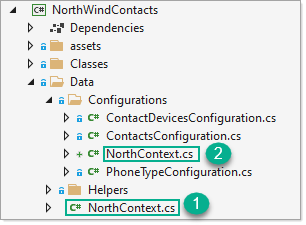

# March 2022 

## Connection strings

In last month’s installment the database connection string was hard-coded as a private variable in NorthWindContext.  This is fine for a quick start but a better idea is to store the connection string in a file which is commonly named appsettings.json.

There is one section `ConnectionStrings` although currently there is one connection string later on we will setup for multiple environments[^1]. With ASP.NET Core connection strings per environment can be read from a Windows environment variable.


### Configuration file

Add a new text file, name it `appsettings.json`

```json
{
  "ConnectionStrings": {
    "DatabaseConnection": "Data Source=.\\SQLEXPRESS;Initial Catalog=NorthWind2020;Integrated Security=True"
  }
}
```

Double click the project node in solution folder and add the following then save. This ensures appsettings.json is copied to the output folder.

```xml
<ItemGroup>
  <None Update="appsettings.json">
    <CopyToOutputDirectory>PreserveNewest</CopyToOutputDirectory>
  </None>
</ItemGroup>
```

### Additional NuGet packages

Double click the project in solution explorer, add the following and save. These are needed for reading from `appsettings.json`

```xml
<ItemGroup>
	<PackageReference Include="Microsoft.Extensions.Configuration" Version="5.0.0" />
	<PackageReference Include="Microsoft.Extensions.Configuration.Binder" Version="5.0.0" />
	<PackageReference Include="Microsoft.Extensions.Configuration.FileExtensions" Version="5.0.0" />
	<PackageReference Include="Microsoft.Extensions.Configuration.Json" Version="5.0.0" />
</ItemGroup>
```


### DbContext code

- 
- Create a class under `Configurations` folder named `NorthContext.cs`
- Change the namespace to `namespace NorthWindContacts.Data` as shown below. Note the class is partial as in the parent class

```csharp
using System.Diagnostics;
using Microsoft.EntityFrameworkCore;
using Microsoft.EntityFrameworkCore.Diagnostics;
using Microsoft.Extensions.Configuration;
using Microsoft.Extensions.Logging;

namespace NorthWindContacts.Data
{
    public partial class NorthContext
    {

    }
}

```

Add the following to the file above.

```csharp
private static IConfigurationRoot ReadAppsettings(out IConfigurationBuilder builder)
{
    builder = new ConfigurationBuilder().AddJsonFile("appsettings.json", optional: false, reloadOnChange: true);
    IConfigurationRoot config = builder.Build();

    return config; // connection string
}
```
 
Next copy the following methods from the original NorthContext to the new file (2)

- NoLogging
- StandardLogging
- CustomLogging
- DatabaseCategoryLogging

Alter each method to call the following line

```csharp
var config = ReadAppsettings(out _);
```

Next replace

```csharp
UseSqlServer(_connectionString)
```

With 

```csharp
UseSqlServer(config.GetConnectionString("DatabaseConnection"))
```

See completed [class here](https://github.com/karenpayneoregon/learn-ef-core-csharp/blob/Level1/NorthWindContacts/Data/Configurations/NorthContext.cs).

Each configuration now reads the connection string from appsettings.json rather than before, a private variable.





For learning purposes, you can setup the database under `localDb`[^2] and `SQL-Server Express edition` to mimic different environments.

## Unit test

- Create a new C# unit test under `Unit test projects` folder named `NorthWindContactsUnitTest`.
- Add a reference to the unit test project for NorthWindContacts.
- Add the following test to the main test class, in this case the class name is `MainTest.cs`

```csharp
using System;
using System.Linq;
using System.Threading.Tasks;
using Microsoft.EntityFrameworkCore;
using Microsoft.VisualStudio.TestTools.UnitTesting;
using NorthWindContacts.Data;
using NorthWindContactsUnitTest.Base;

namespace NorthWindContactsUnitTest
{
    [TestClass]
    public partial class MainTest : TestBase
    {
        [TestMethod]
        [TestTraits(Trait.PlaceHolder)]
        public async Task GetContactsCount()
        {
            await using var context = new NorthContext();
            var results = await context.Contacts.CountAsync();
            Assert.AreEqual(results, 91);
        }
    }
}
```

- Run the test. Having this test pass confirms the connection code works.

[^1]: Environments indicated development, staging/test or production.

[^2]: SQL Server Express LocalDB is a feature of SQL Server Express targeted to developers. It is available on SQL Server Express with Advanced Services. LocalDB installation copies a minimal set of files necessary to start the SQL Server Database Engine. Once LocalDB is installed, you can initiate a connection using a special connection string.