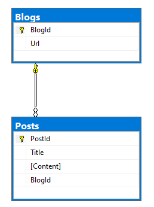

# Demonstrates

Uses `SQL-Server` localDb database, creates the database under the user profile.

EF Core creates tables from the models provided for, in this case a simple schema.

If a database already exists then no action is taken, otherwise the database is created for you.

- Creating a database
- Deleting a database
- Performs common save operations

